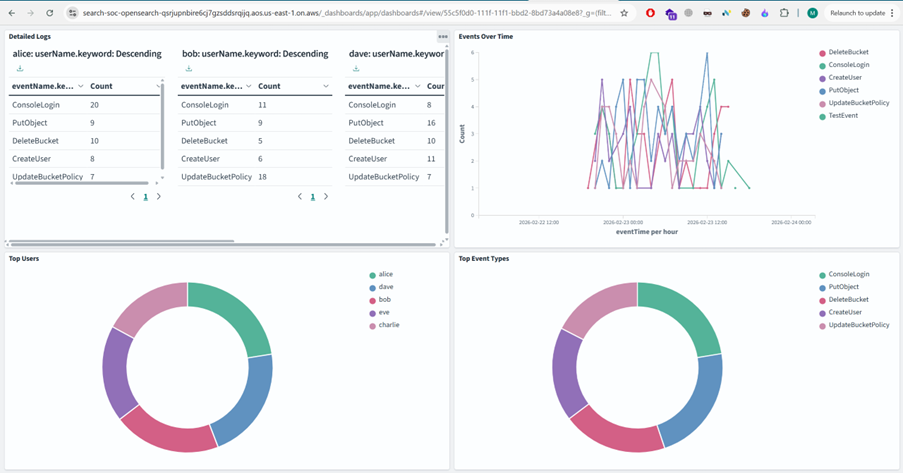
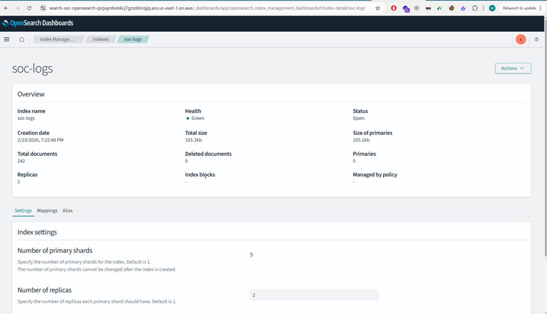
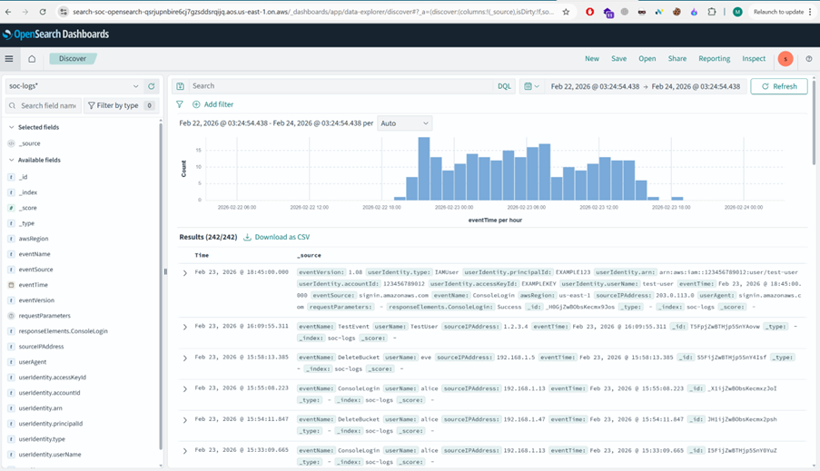
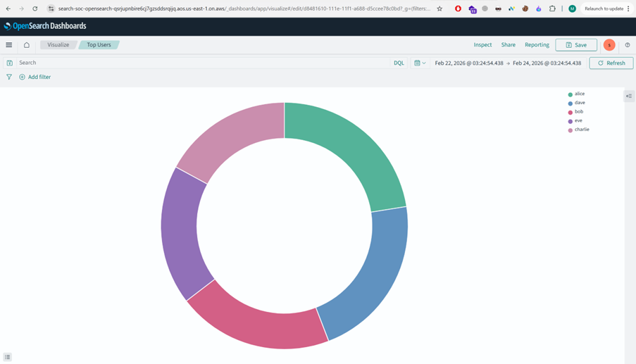
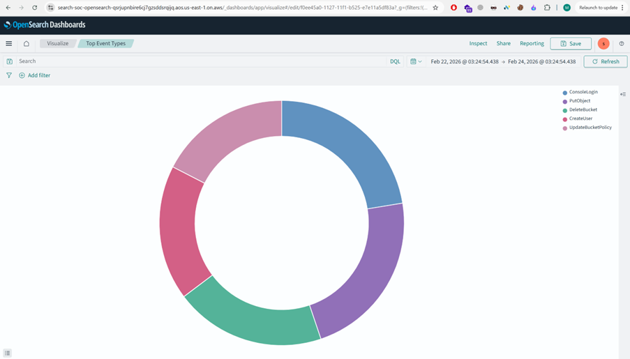
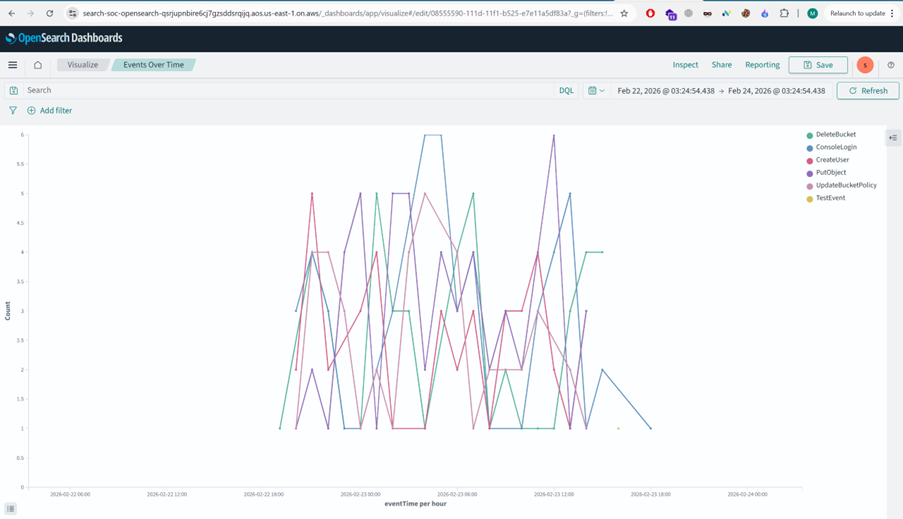
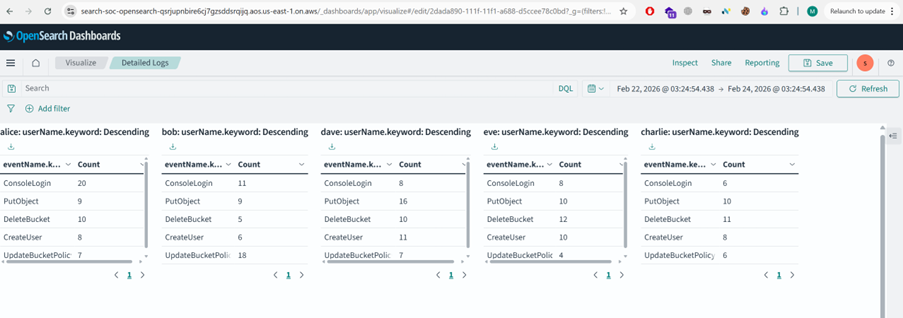

# SOC Log Monitoring using AWS OpenSearch

## Project Overview
This project demonstrates a Security Operations Center (SOC) monitoring pipeline using AWS OpenSearch.

It includes:
- OpenSearch Domain Setup
  
- Index Management
  
- Log Ingestion using Python
  
- Visualization & Dashboards
  
  
  
  
- Sample Log Generator

## Architecture
Refer to architecture.md

## Setup Instructions
Refer to setup.md

## Python Scripts
- create_index.py → Creates index
- generate_sample_logs.py → Generates synthetic SOC logs
- push_logs.py → Pushes logs to OpenSearch
- delete_index.py → Deletes index

## Screenshots
Screenshots available in /screenshots folder.

## Technologies Used
- AWS OpenSearch
- Python
- OpenSearch-Py
- Kibana / OpenSearch Dashboards

